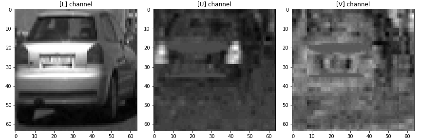
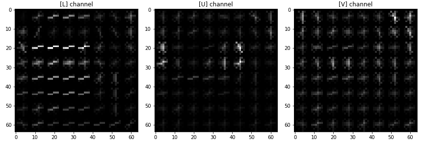
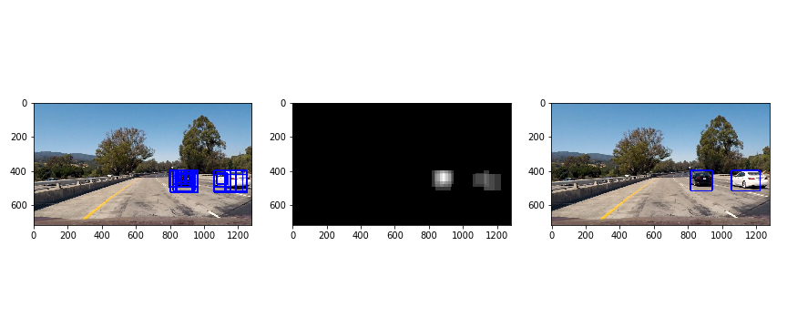
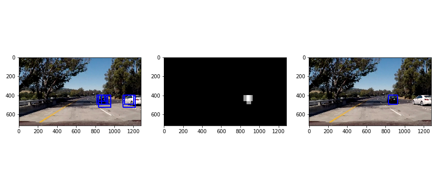

# Vehicle Detection Project

## Project goals

The goals / steps of this project are the following:

* Perform a Histogram of Oriented Gradients (HOG) feature extraction on a
  labeled training set of images and train a classifier Linear SVM classifier
* Optionally, you can also apply a color transform and append binned color
  features, as well as histograms of color, to your HOG feature vector;
* Implement a sliding-window technique and use your trained classifier to search
  for vehicles in images;
* Run your pipeline on a video stream and create a heat map of recurring
  detections frame by frame to reject outliers and follow detected vehicles;
* Estimate a bounding box for vehicles detected.

## Project files

The submission includes the following files:

* `hog-exploration.ipynb` is a Jupyter notebook where I explore HOG
  transformation; 
* `feature-selection.ipynb` is a Jupyter notebook that contains code to select
  feature extraction parameters and train a classifier;
* `vehicle-delection.ipynb` is a Jupyter notebook where I implement the vehicle
  searching algorithm and apply it to the project's video file;
* `common.py` is a Python file that contains code shared between notebooks;
* `test_images/project_video.mp4` is a video output produced by the pipeline;
* `README.md` is a report that summarizes the results.

## Solution description

### Histogram of Oriented Gradients

The project's description suggests using a method called *Histogram of Oriented
Gradients* to extract features from the image, suitable for robust vehicle
detection classifier. 

To extract HOG features, I use a function `skimage.hog` (lines 10-16 in
`common.py`). As an example, I use one of the vehicle images from the training
dataset (converted to LUV color space):

Each color channel can undergo the HOG transformation, with the following output
result (using the visualization provided by `skimage.hog()`):

HOG transformation is controlled by a number of parameters that can impact the
end result and, eventually, the performance of the classifier that uses
extracted features. The next step in the project is to explore the parameter
space and select such values that provide best classification accuracy.

### Parameter selection

The solution for selecting the optimal feature extraction parameters is located
in the Jupyter notebook [feature-selection.ipynb](./feature-selection.ipynb).

The number of feature selection parameters to be tuned is quite large and it's
not obvious how they would impact the performance of the detection algorithm. I
decided to try various combinations and select those where the classifier would
show the best accuracy. 

To accomplish this task, I decided to use the grid search approach, implemented
in `sklearn`. As the exhaustive search through all parameter combinations would
take a lot of time, I ended up using a randomized grid search with a limited
number of iterations that would try out different combinations selected at
random. 

`sklearn` library provides the following classes that fit the task at hand: 

* `Pipeline` class allows to combine different transformations and classifiers
  into a tunable pipeline;
* `RandomizedGridSearch` class implements the search algorithm that tries out
  different parameter combinations and keeps track of the best results. 
  
In order to plug the feature extration algorithm into a pipeline, I implemented
a class `FeatureExtractor` that is essentially an adapter around
`extract_features()` function, suitable for prugging into the grid search. 

The complete classification pipeline consists of the following blocks (cell #7):

* `FeatureExtractor` that extracts HOG, spacial, and color features from the raw
  images;
* `StandardScaler` scales the features to zero mean and unit variance;
* `LinearSVC` is a Support Vector Machine classifier to do the job. 

The pipeline is then plugged into the `RandomizedGridSearch`. 

Here is the parameter combination that the grid search found to show the
best performance (extracted from `output_model/gridsearch_result.csv`):

| Feature        | Value |
|:---------------|------:|
| Color Space    | YUV   |
| Histogram bins | 32    |
| Spatial size   | 32    |
| Orientation bins | 11  |
| Pixels per cell | 8    |
| Cells per block | 2    |
	
I used train/test split (80/20) of the original dataset to estimate the
classifier performance. With the parameters above, the classification accuracy
was 0.9949, or 99.5% (cell #11).

At the end, I save the best trained classifier into a Pickle file
[output_model/model.pkl](./output_model/model.pkl), along with the parameter
values, for use in vehicle detection. Note that I remove the `FeatureExtractor`
instance from the pipeline before saving, as I decided to use an optimized
sliding window approach for vehicle detection (see below).

### Sliding window search

The pipeline for vehicle detection is located in the Jupyter notebook
[vehicle-delection.ipynb](./vehicle-delection.ipynb).

To search for the vehicle in the bigger images I decided to use the algorithm
that would calculate the HOG features for the entire image and then sub-samples
the 64-pixel windows from the feature matrix. This algorithm showed better
performance in terms of speed and reasonable accuracy. The algorithm is
implemented in the class `CarFinder`, located in the cell #4. 

The implementation allows for scaling the image prior to feature
extraction. Effectively, it means that I can use different search window sizes,
relative to the image size. 

As a result, the algorithm returns a set of rectangle coordinates for search
windows that were detected as containing a car. This set of rectangles is then
processed to produce the average bounding rectangle (see below).

### Vehicle detection

The complete algorithm that detects vehicles and their corresponding bounding
rectangles in an image is implemented in the class `AccumulativeCarDetector`,
located in the cell #5. 

The algorithm is tailored to process video streams, so it averages the detection
result across previous 20 frames, to provide smoother operation and remove false
positives. The steps executed for each video frame image are: 

1. Using the `CarFinder` sliding window search implementation, search for the
vehicles with window sizes 64, 96, and 128 pixels (respective scale factors are
1, 1.5, and 2). I figured that these window sizes provide the best results for
different car sizes.
2. Using current and previous 19 detections, build a heat map where the `hot`
regions identify the car(s).
3. Threshold the heat map to remove occasional false positive detections, with
the threshold value of 40, and calculate the bounding rectangles that enclose
`hot` regions. 

Here are some example images that show detected hot windows, the thresholded
heatmap, and the resulting bounding rectangles that mark the vehicles in images:

Notice that thresholding helped eliminate the false positive detection in the
3rd image above. 

### Video implementation

The video processing pipeline is located in cells 6-7 in the notebook.
The resulting video is written to the file at [output_images/project_video.mp4](./output_images/project_video.mp4)

## Discusson

The challenges I faced during the project was to implement an efficient
algorithm for sliding window search. The simple sliding window alogorithm was
too slow, so I ended up with a more complicated, but efficient HOG subsampling
algorithm. 

I also had some issues with false positive detections that were removed by
applying thresholding and approximation across multiple video frames. 

There are a few improvements I could suggest: 

1. Track the detected vehicles accross multiple frames and use more sensitive
algorithm around the detected vehicle to find the object's boundaries more
accurately. 
2. Process multiple windows in parallel to improve algorithm's speed.

g

